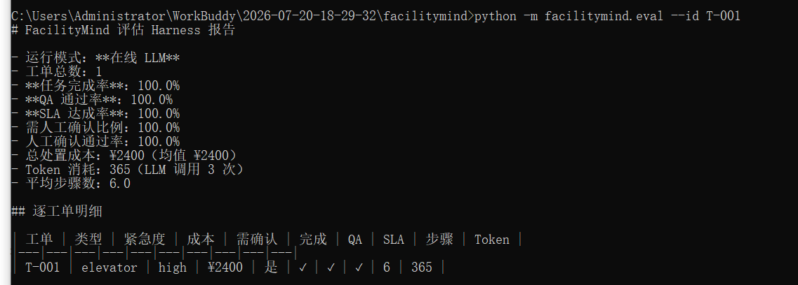
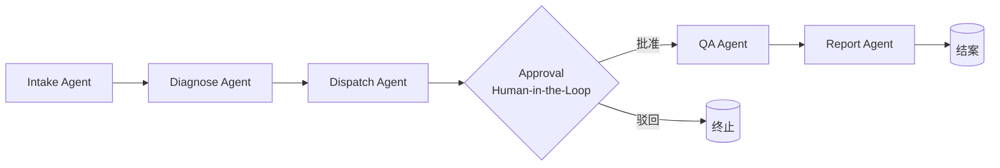
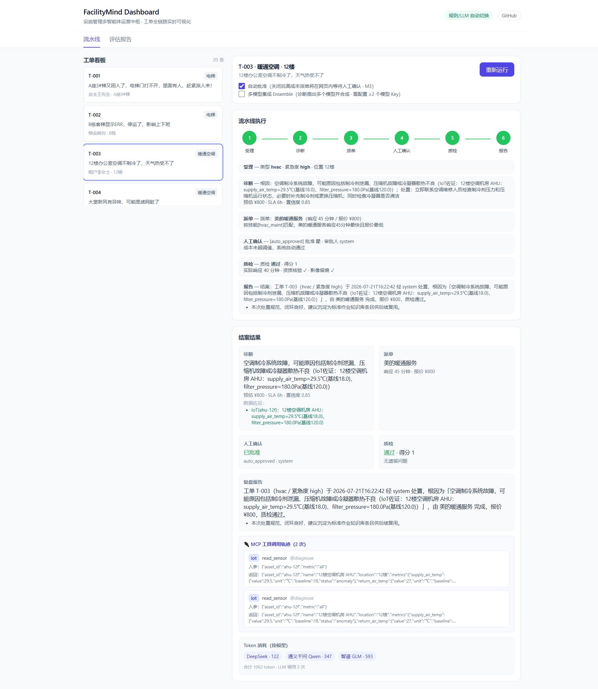

# FacilityMind

> **`facility-multiagents`** · 基于 LangGraph + MCP 的设施管理多智能体运营中枢
>
> A multi-agent operations center for facility and property management.
> Built with LangGraph + MCP, featuring controllable orchestration and human-in-the-loop-ready design.

[](https://www.python.org/)
[](LICENSE)
[](https://github.com/langchain-ai/langgraph)

## Why FacilityMind

物业与设施管理里大量工作是"接报修 → 判原因 → 派工人 → 验质量 → 出报告"的重复链路。
单 Agent 聊天机器人解决不了跨系统、跨专业的闭环；FacilityMind 用**多个有明确职责的 Agent + 状态机编排**，
把这条链路自动化、可追溯、可干预。

## Features

| Feature             | Description                                                         |
| ------------------- | ------------------------------------------------------------------- |
| 🧠 多 Agent 协作       | Intake / Diagnose / Dispatch / Approval / QA / Report 六 Agent 流水线闭环 |
| 🛡️ 可控编排            | LangGraph 状态机，节点可审计、可重放、可扩展                                         |
| 🤝 多模型协作            | 支持多模型配置，可按 Agent 路由；Diagnose 阶段可多模型集成并合成结论 |
| ✋ Human-in-the-Loop | 高价值派单自动暂停，经 interrupt() 等待人工确认，可批准/驳回                               |
| ✅ QA 质检             | 模拟现场执行并对照检查清单逐项核验，输出通过与综合评分                                         |
| 📝 复盘报告             | Report Agent 自动生成结案摘要与可执行的优化建议                                      |
| 📈 评估 Harness       | 一键批量跑工单，量化任务完成率 / QA 通过率 / SLA 达成率 / 成本 / token，输出 Markdown + JSON  |
| 🔌 LLM 可插拔          | 有 Key 走大模型，无 Key 走规则库，二者无缝切换；支持 DeepSeek / Qwen / 智谱 / Ollama 多家模型  |
| 📚 内置知识库            | 8 类常见设施故障的处理经验 + 每类 QA 检查清单，离线可用                                    |
| 🔁 历史感知             | 识别同一位置重复故障并自动升级处置                                                   |
| 🆚 规则 vs LLM 对比     | `--compare` 并排展示规则库与 DeepSeek 的结论差异，验证模型是否真起作用                      |
| 🖥️ Web Dashboard   | 打开浏览器即可看 6-Agent 流水线实时点亮，并在网页内做人工确认、看评估图表                           |
| 🔗 MCP 工具接入        | Agent 通过 MCP 协议调用真实业务系统（内置 IoT 传感器），实现"证据化诊断"；server 不可用时自动回退规则库 |
| 📊 结构化输出            | 每条工单产出根因、处置、成本、SLA、派单、质检、报告全链路                                      |

## Quick Start

### 本地运行

```bash
cd facilitymind
python -m venv .venv && source .venv/bin/activate   # Windows: .venv\Scripts\activate
pip install -r requirements.txt

# 跑一个电梯故障场景（无需任何 API Key）
python -m facilitymind.cli --scenario elevator_fault

# 或跑全部 20 条内置示例工单
python -m facilitymind.cli --all
```


### 接入真实大模型（可选）

FacilityMind 支持**多模型共存与协作**，不是只绑一个 provider：

- 复制 `.env.example` 为 `.env`，填入兼容 OpenAI 的接口；
- 再在 `facilitymind/models.json` 里声明各家模型（已内置 DeepSeek / 通义千问 Qwen / 智谱 GLM / Ollama 本地）。

```bash
cp .env.example .env
# 编辑 .env：可填一个或多个模型的 API Key
# LLM_API_KEY=sk-xxx          # DeepSeek（默认）
# QWEN_API_KEY=sk-xxx         # 通义千问
# ZHIPU_API_KEY=xxx           # 智谱 GLM
# OLLAMA_API_KEY=ollama       # 本地 Ollama
```
不设则自动进入离线规则模式；填了任意 Key 后，对应模型即自动启用，且任意 API 错误都会安全回退规则库。`models.json` 里可进一步配置。

> 只要对应 `*_API_KEY` 非空，CLI / eval / Dashboard 即自动启用对应模型。

## Usage

```bash
# 按 ID 运行（成本超阈值会触发人工确认节点，终端内可批准/驳回）
python -m facilitymind.cli --id T-001

# 跳过人工确认
python -m facilitymind.cli --id T-001 --auto

# 预设场景
python -m facilitymind.cli --scenario hvac_fault
python -m facilitymind.cli --scenario leak

# 全部示例（自动批准）
python -m facilitymind.cli --all

# 对比「规则库」与「LLM」对同一工单的结论差异（验证模型是否真起作用）
python -m facilitymind.cli --id T-001 --compare

# 使用多模型集成（Diagnose 阶段多个模型并合成结论）
python -m facilitymind.cli --id T-001 --ensemble

# 同时开启多模型集成并跳过人工确认
python -m facilitymind.cli --id T-001 --ensemble --auto

# 横向对比多个模型在相同诊断任务上的输出差异（--compare-models 会调用 models.json 中已启用的模型）
python -m facilitymind.cli --id T-001 --compare-models
```

示例输出（电梯困人，触发人工确认节点）：

```
🔔 [HITL] 触发人工确认节点： 工单 T-001 派单报价 ¥2400 超过自动审批阈值 ¥2000，需人工确认是否批准。
   批准该派单？(y/N): y

====================================================================
工单 T-001 · elevator · 紧急度=high · 位置=A座3#梯
----------------------------------------------------------------
诊断根因 : 门机控制器接触不良或光幕遮挡
建议处置 : 更换门机控制器并校准光幕
预估成本 : ¥2400    SLA : 2h    置信度 : 0.82
派单方案 : 迅达电梯维保（响应 30 分钟 / 报价 ¥2400）
人工确认 : [approved] 批准=True 审批人=现场主管
实际响应 : 35 分钟 | 资质核验=True | 影像留痕=True
质检结果 : 通过  得分=1.0  问题=无
结案摘要 : 工单 T-001（elevator / 紧急度 high）... 质检通过。
   建议 · 属高价值工单，建议评估年度维保框架合同以锁定单价，降低单次处置成本。
====================================================================
```
> 质检未通过的工单会列出具体未达标项（如「维修前后影像留痕」「作业人员资质核验」），并在结案建议中提示加强过程管理。

## 评估 Harness

把多 Agent 工作流当成**可度量系统**来跑，而不是只看单条 demo。一键得到这套方案"好不好用"的量化证据：

```bash
# 评估全部 20 条内置工单，终端直接看汇总 + 明细
python -m facilitymind.eval --all

# 导出 Markdown 报告 + 原始 JSON
python -m facilitymind.eval --all --out eval_report.md --json eval_report.json

# 单条工单
python -m facilitymind.eval --id T-001

# 只打印关键指标（CI 用）
python -m facilitymind.eval --all --quiet
```

采集指标：任务完成率、QA 通过率、SLA 达成率、需人工确认比例、总/均处置成本、Token 消耗、平均步骤数。
在线 LLM 模式（DeepSeek）示例输出：




## 多Agent


| Agent              | 职责                                                  |
| ------------------ | --------------------------------------------------- |
| **Intake Agent**   | 把报修文本结构化为工单（类型 / 紧急度 / 位置）                          |
| **Diagnose Agent** | 结合知识库与历史，给出根因、处置建议、成本、SLA，识别重复故障                    |
| **Dispatch Agent** | 按技能匹配资源池，输出最优派单方案                                   |
| **Approval Agent** | Human-in-the-Loop 节点：成本超阈值时经 `interrupt()` 暂停等待人工确认 |
| **QA Agent**       | 模拟现场执行，对照检查清单逐项核验，输出通过与综合评分                         |
| **Report Agent**   | 汇总全线结论，生成结案摘要与可执行的优化建议                              |


## 多模型协作

FacilityMind 的 LLM 层不是单例，而是一个**可扩展的 Model Registry**。

```
┌─────────────┐   ┌─────────────┐   ┌─────────────┐   ┌─────────────┐
│  DeepSeek   │   │  通义千问   │   │  智谱 GLM   │   │   Ollama    │
│   (默认)     │   │   (可选)    │   │   (可选)    │   │   (本地)    │
└──────┬──────┘   └──────┬──────┘   └──────┬──────┘   └──────┬──────┘
       │                  │                 │                 │
       └──────────────────┴─────────────────┴─────────────────┘
                          │
                   Model Registry
                          │
       ┌──────────────────┼──────────────────┐
       │                  │                  │
  ┌────┴────┐        ┌────┴────┐       ┌────┴────┐
  │ 按 Agent │        │  Ensemble  │      │  对比/评估  │
  │  路由    │        │ 多模型集成  │      │  按模型拆 Token │
  └─────────┘        └─────────┘      └─────────┘
```

**两种协作模式：**

1. **按 Agent 路由**：通过 `models.json` 的 `agent_routing` 给不同 Agent 分配擅长模型。例如让响应快的模型做 Intake、推理强的模型做 Diagnose、成本低的模型做 Report。
2. **Ensemble 多模型集成**：在 Diagnose 阶段同时把同一工单丢给多个模型，各自输出诊断结论，再由 Synthesizer 整合出最终根因、置信度和处置建议。适合复杂/高价值故障，可降低单一模型幻觉带来的风险。

**按模型计量成本**：每条流水线、每批评估，都会按模型拆分 Token 消耗与调用次数，方便横向对比模型性价比。



> 上图：Dashboard 运行 T-001 时，Diagnose 阶段启用了 DeepSeek + 通义千问 + 智谱三家 Ensemble，结案面板直接展示每家模型消耗的 Token 数。

## Web Dashboard

把"接报修 → 诊断 → 派单 → 人工确认 → 质检 → 报告"的全链路搬进浏览器：
打开页面即可看到 6 个 Agent 节点**实时点亮**、每步产出同步展示；高成本派单会在网页内弹出审批卡片，点「批准 / 驳回」后流程继续；
还有独立的「评估报告」页，用图表呈现完成率 / QA / SLA / 成本等量化指标；勾选「多模型集成 Ensemble」后，Diagnose 阶段会调用多个模型，并在结案结果中展示每个模型的 Token 消耗。
```bash
# 启动 Dashboard（默认 http://127.0.0.1:8000）
python -m facilitymind.web

# 指定端口
python -m facilitymind.web --port 9000
```

打开浏览器后的玩法：

- **流水线页**：左侧选工单 → 点「运行流水线」→ 右侧 6 节点依次亮起，每步结论实时滚动。
- **人工确认（M3）**：取消勾选「自动批准」，成本超阈值（¥2000）的工单会在网页内暂停并弹出审批卡，批准/驳回后流水线继续——真正的浏览器内 Human-in-the-Loop。
- **评估报告页（M4）**：顶部切到「评估报告」，图表化展示完成率、QA 通过率、SLA 达成率、逐工单成本与明细表（数据来自评估 harness 的批量运行）。

  <br />


## MCP 工具接入

让 Agent 不止"凭知识库推理"，更能**调用真实业务系统的数据**来驱动诊断。

当前内置一个**自研本地 IoT MCP server**（真实 MCP 协议、模拟真实时序数据、可离线运行）：Diagnose Agent 在诊断 HVAC / 漏水 / 照明 / 消防类工单时，会按工单位置映射对应资产，调用 `iot.read_sensor` 拉取实时读数（送风温度、滤网压差、能耗、压力等），并把这些读数作为**证据**写入诊断结论（如 `（IoT佐证：12楼空调机房 AHU：supply_air_temp=29.5℃(基线18.0)、filter_pressure=180.0Pa(基线120.0)）`）。

**架构分层（确定性工具调用优先，稳且离线友好）**：

```
Agent ──> facilities_mcp.providers  ──> MCPHub（按 mcp.json 起 server 子进程）
                │                          ├─ 离线回退：server 未起/超时 → 回退 KB
                │                          └─ 错误隔离：单 server 故障不拖垮整条流水线
                └─ 资产映射：工单 location_hint → 受监控资产
```

- `mcp.json` 声明要接入的 server（name / transport / module）；`mcp/` 包提供 `MCPHub` 与 `providers` 封装，并对每一次调用做离线回退。
- **新增一个业务系统 = 跑一个 MCP server + 在 `mcp.json` 加一行**，Agent 侧代码无需改动；将来接真实 CMMS / ERP / IM 平台，只需把 `module` 换成真实 server 的启动命令。
- Dashboard 顶部实时显示各 MCP server 的在线状态；结案面板展示「🔌 MCP 工具调用轨迹」与「数据佐证」。

```jsonc
// mcp.json（根目录）
{
  "servers": [
    { "name": "iot", "transport": "stdio", "module": "facilitymind.mcp.servers.iot", "enabled": true }
    // 接真实系统时再加一行，例如 CMMS / ERP / IM
  ]
}
```

**本地 Demo**：一键启动 Dashboard

```bash
python scripts/run_demo.py        # 自动起服务并打开 http://localhost:8000
# 或手动
python -m facilitymind.web --port 8000
```

> 场景扩展（能耗优化 / 预防性保养）可作为后续规划，当前已打通"设备报修"单一场景与 MCP 接入地基。

## Project Layout

```
facilitymind/
├── facilitymind/
│   ├── state.py        # 多 Agent 共享状态定义
│   ├── llm.py          # LLM 抽象层
│   ├── knowledge.py    # 领域知识库与规则引擎
│   ├── dataio.py       # 合成数据加载
│   ├── agents/         # 各 Agent 节点
│   ├── graph.py        # LangGraph 状态机编排
│   ├── cli.py          # 命令行入口
│   ├── eval.py         # 评估 harness
│   ├── compare.py      # 规则库 vs LLM 对比工具
│   ├── web/            # Web Dashboard
│   │   ├── server.py   # SSE 实时流 + 网页 HITL + 评估接口
│   │   ├── __main__.py # uvicorn 启动入口
│   │   └── static/index.html  # 流水线可视化 + 审批卡 + 评估页
│   └── data/tickets.json
├── docs/images/        
├── requirements.txt
├── docker-compose.yml
└── README.md
```

## Roadmap

- [x] Phase 1: MVP 可运行（Intake → Diagnose → Dispatch + CLI + 离线模式）
- [x] Phase 2: Human-in-the-Loop 审批节点、QA Agent、Report Agent（共 6 个 Agent 闭环）
- [x] Phase 3: 评估 harness（任务完成率 / QA 通过率 / SLA 达成率 / 成本 / token · 一键 Markdown+JSON 报告）
- [x] Phase 4: Web Dashboard&#x20;
- [x] Phase 5: 多模型协作
- [x] Phase 5.5: MCP 工具接入
- [ ] Phase 6: 多场景扩展（能耗优化、预防性保养）、CMMS / ERP / IM server、社区运营与双语文档

## License

[MIT](LICENSE)
