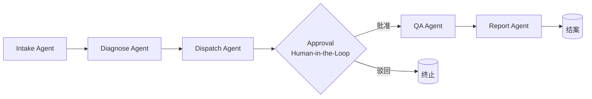

# FacilityMind

> A multi-agent operations center for facility and property management.
> Built with LangGraph + MCP, featuring controllable orchestration and human-in-the-loop-ready design.

[](https://www.python.org/)
[](LICENSE)
[](https://github.com/langchain-ai/langgraph)

## Why FacilityMind

物业与设施管理里大量工作是"接报修 → 判原因 → 派工人 → 验质量 → 出报告"的重复链路。
单 Agent 聊天机器人解决不了跨系统、跨专业的闭环；FacilityMind 用**多个有明确职责的 Agent + 状态机编排**，
把这条链路自动化、可追溯、可干预。

- 不依赖任何外部 API 即可运行：内置规则知识库，开箱即跑
- 接入真实大模型即升级：配置 `LLM_API_KEY` 后自动切换为 LLM 推理
- 架构清晰可控：LangGraph 状态机，每个节点可审计、可重放、可加人工确认

## Features

| Feature | Description |
|---------|-------------|
| 🧠 多 Agent 协作 | Intake / Diagnose / Dispatch / Approval / QA / Report 六 Agent 流水线闭环 |
| 🛡️ 可控编排 | LangGraph 状态机，节点可审计、可重放、可扩展 |
| ✋ Human-in-the-Loop | 高价值派单自动暂停，经 interrupt() 等待人工确认，可批准/驳回 |
| ✅ QA 质检 | 模拟现场执行并对照检查清单逐项核验，输出通过与综合评分 |
| 📝 复盘报告 | Report Agent 自动生成结案摘要与可执行的优化建议 |
| 📈 评估 Harness | 一键批量跑工单，量化任务完成率 / QA 通过率 / SLA 达成率 / 成本 / token，输出 Markdown + JSON |
| 🔌 LLM 可插拔 | 有 Key 走大模型，无 Key 走规则库，二者无缝切换 |
| 📚 内置知识库 | 8 类常见设施故障的处理经验 + 每类 QA 检查清单，离线可用 |
| 🔁 历史感知 | 识别同一位置重复故障并自动升级处置 |
| 🆚 规则 vs LLM 对比 | `--compare` 并排展示规则库与 DeepSeek 的结论差异，验证模型是否真起作用 |
| 📊 结构化输出 | 每条工单产出根因、处置、成本、SLA、派单、质检、报告全链路 |

## Quick Start

### 方式一：本地运行（推荐先试）

```bash
cd facilitymind
python -m venv .venv && source .venv/bin/activate   # Windows: .venv\Scripts\activate
pip install -r requirements.txt

# 跑一个电梯故障场景（无需任何 API Key）
python -m facilitymind.cli --scenario elevator_fault

# 或跑全部 20 条内置示例工单
python -m facilitymind.cli --all
```

### 方式二：Docker

```bash
docker compose up --build
```

### 接入真实大模型（可选）

复制 `.env.example` 为 `.env`，填入兼容 OpenAI 的接口：

```bash
cp .env.example .env
# 编辑 .env：设置 LLM_API_KEY / LLM_BASE_URL / LLM_MODEL
```

不设则自动进入离线规则模式。

> 已内置 `python-dotenv`：`.env` 会在程序启动时自动读取，无需手动 `export`。
> 只要 `LLM_API_KEY` 非空，CLI / eval 即自动切入在线 LLM 模式，且任意 API 错误都会安全回退规则库。

## Usage

```bash
# 按 ID 运行（成本超阈值会触发人工确认节点，终端内可批准/驳回）
python -m facilitymind.cli --id T-001

# 跳过人工确认（批量评估、CI 用）
python -m facilitymind.cli --id T-001 --auto

# 预设场景
python -m facilitymind.cli --scenario hvac_fault
python -m facilitymind.cli --scenario leak

# 全部示例（自动批准）
python -m facilitymind.cli --all

# 对比「规则库」与「DeepSeek(LLM)」对同一工单的结论差异（验证模型是否真起作用）
python -m facilitymind.cli --id T-001 --compare
```

示例输出（电梯困人，触发人工确认节点）：

```
🔔 [HITL] 触发人工确认节点： 工单 T-001 派单报价 ¥2400 超过自动审批阈值 ¥2000，需人工确认是否批准。
   批准该派单？(y/N): y

====================================================================
工单 T-001 · elevator · 紧急度=high · 位置=A座3#梯
----------------------------------------------------------------
诊断根因 : 门机控制器接触不良或光幕遮挡
建议处置 : 更换门机控制器并校准光幕
预估成本 : ¥2400    SLA : 2h    置信度 : 0.82
派单方案 : 迅达电梯维保（响应 30 分钟 / 报价 ¥2400）
人工确认 : [approved] 批准=True 审批人=现场主管
实际响应 : 35 分钟 | 资质核验=True | 影像留痕=True
质检结果 : 通过  得分=1.0  问题=无
结案摘要 : 工单 T-001（elevator / 紧急度 high）... 质检通过。
   建议 · 属高价值工单，建议评估年度维保框架合同以锁定单价，降低单次处置成本。
====================================================================
```

> 非交互环境（如 CI / 脚本）下会自动批准，并打印触发标记，方便验证 HITL 逻辑已生效。
> 质检未通过的工单会列出具体未达标项（如「维修前后影像留痕」「作业人员资质核验」），并在结案建议中提示加强过程管理。

## 评估 Harness

把多 Agent 工作流当成**可度量系统**来跑，而不是只看单条 demo。一键得到这套方案"好不好用"的量化证据：

```bash
# 评估全部 20 条内置工单，终端直接看汇总 + 明细
python -m facilitymind.eval --all

# 导出 Markdown 报告 + 原始 JSON（可接 CI / 写进 README）
python -m facilitymind.eval --all --out eval_report.md --json eval_report.json

# 单条工单
python -m facilitymind.eval --id T-001

# 只打印关键指标（CI 用）
python -m facilitymind.eval --all --quiet
```

采集指标：任务完成率、QA 通过率、SLA 达成率、需人工确认比例、总/均处置成本、Token 消耗、平均步骤数。

> 离线规则模式下 Token 恒为 0（未调用大模型），报告会标注运行模式，保证指标诚实可读。
> 接入真实大模型后，Token 字段即真实用量，可直接用于"规则 vs LLM"的成本/质量权衡分析。

示例报告（`eval_report.md`）：

```
- 运行模式：离线规则
- 工单总数：20
- 任务完成率：100.0%
- QA 通过率：80.0%
- SLA 达成率：100.0%
- 需人工确认比例：20.0%
- 总处置成本：¥16550（均值 ¥828）
- Token 消耗：0（LLM 调用 0 次）
- 平均步骤数：6.0
```

## Architecture



| Agent | 职责 |
|-------|------|
| **Intake Agent** | 把报修文本结构化为工单（类型 / 紧急度 / 位置） |
| **Diagnose Agent** | 结合知识库与历史，给出根因、处置建议、成本、SLA，识别重复故障 |
| **Dispatch Agent** | 按技能匹配资源池，输出最优派单方案 |
| **Approval Agent** | Human-in-the-Loop 节点：成本超阈值时经 `interrupt()` 暂停等待人工确认 |
| **QA Agent** | 模拟现场执行，对照检查清单逐项核验，输出通过与综合评分 |
| **Report Agent** | 汇总全线结论，生成结案摘要与可执行的优化建议 |

## Project Layout

```
facilitymind/
├── facilitymind/
│   ├── state.py        # 多 Agent 共享状态定义
│   ├── llm.py          # LLM 抽象层（有 Key 走模型，无 Key 走规则）
│   ├── knowledge.py    # 领域知识库与规则引擎
│   ├── dataio.py       # 合成数据加载
│   ├── agents/         # 各 Agent 节点
│   ├── graph.py        # LangGraph 状态机编排
│   ├── cli.py          # 命令行入口
│   ├── eval.py         # 评估 harness（批量指标 + 报告）
│   └── data/tickets.json
├── requirements.txt
├── docker-compose.yml
└── README.md
```

## Roadmap

- [x] Phase 1: MVP 可运行（Intake → Diagnose → Dispatch + CLI + 离线模式）
- [x] Phase 2: Human-in-the-Loop 审批节点、QA Agent、Report Agent（共 6 个 Agent 闭环）
- [x] Phase 3: 评估 harness（任务完成率 / QA 通过率 / SLA 达成率 / 成本 / token · 一键 Markdown+JSON 报告）
- [x] Phase 3: GitHub 仓库已发布（digitsouler/facility-multiagents）
- [ ] Phase 3 (待续): Web Dashboard（实时 Agent 状态流可视化）
- [ ] Phase 4: MCP 工具接入（CMMS / IoT / ERP / IM）、多场景扩展（能耗优化、预防性保养）、社区运营

## License

[MIT](LICENSE)
