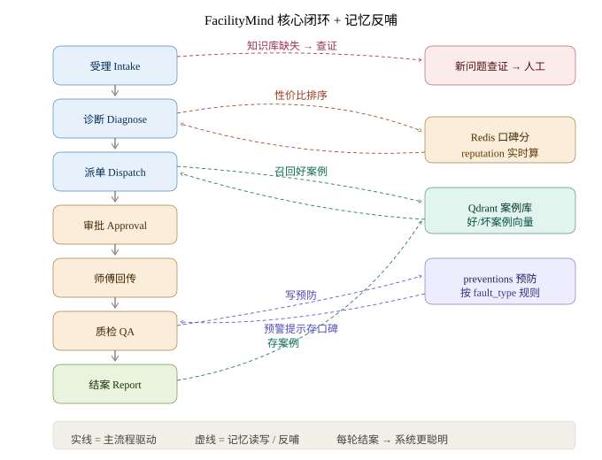
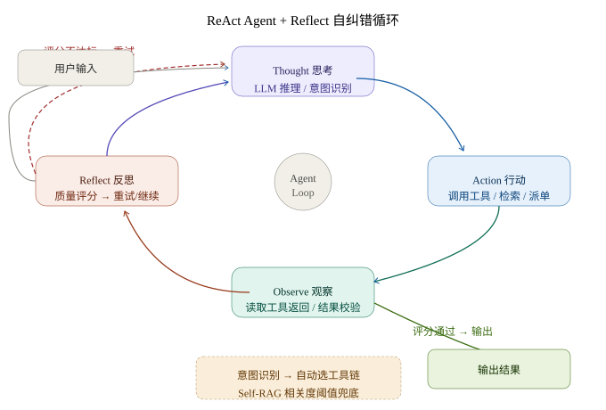
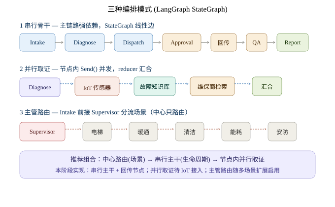

# FacilityMind

> 基于 LangGraph 的多 Agent 设施管理智能运营系统 —— 会推理、有记忆、越用越聪明

[](https://www.python.org/)
[](LICENSE)
[](https://github.com/langchain-ai/langgraph)

---

## 它解决什么问题

物业/园区设施报修是一条重复链路：**接报修 → 判原因 → 派工人 → 验质量 → 出报告**。
单 Agent 聊天机器人解决不了跨系统、跨专业的闭环；FacilityMind 用**多个有明确职责的 Agent + 状态机编排**把这条链路自动化、可追溯、可干预，而且每一步决策都结合知识库、带记忆、能自我纠错。

---

## 核心亮点

| 亮点 | 它强在哪 |
|------|----------|
| 🧠 **ReAct 推理 + Reflect 自纠错** | 每个诊断/派单节点内部是 Thought→Action→Observe→Reflect 循环，评分不达标自动重试，不靠一次调用定生死 |
| 🎯 **意图识别路由** | 接入层 `route_intent` 自动判别工单类型，决定走哪条处理链路 |
| 💾 **四维记忆反哺** | Qdrant 案例库 + Redis 供应商口碑分 + 预防规则库 + 人工查证通道，每结一单系统比开工时更懂业务 |
| 💰 **供应商性价比优选** | 派单不是随机或纯价低者得，综合口碑×技能×地域×价格×可用性实时打分排序 |
| 🔌 **MCP Server 可扩展** | 预留 MCP 协议接口，可接入外部 IoT / 工单 / 设备系统 |

---

## 架构

### 1. 九节点闭环 + 四维记忆反哺

系统不是一次性问答，而是一条**有状态的 StateGraph 生命周期管线**。每个阶段都能读写记忆，结案后系统比开工时更聪明。



| 阶段 | 做什么 | 读/写哪些记忆 |
|------|--------|---------------|
| **Intake 受理** | 意图识别、信息补全、去重 | KB 缺失 → 转人工查证 |
| **Diagnose 诊断** | 故障定位、根因分析 | 读 Redis 口碑分排序供应商；读 Qdrant 召回历史好案例 |
| **Dispatch 派单** | 匹配最优维保商 | 综合口碑 × 技能匹配 × 地域 × 价格选出性价比最高的 |
| **Approval 审批** | 人机协作确认（HITL 人工闸） | 高成本派单触发审批，人做最终决定 |
| **Technician 回传 / QA / Report** | 师傅反馈、质检校验、结案归档 | 写预防规则(preventions)、存案例向量(Qdrant)、更新供应商口碑(Redis) |

**关键设计：记忆不是附加组件，而是每个节点的原生依赖。**

---

### 2. ReAct Agent 循环 + Reflect 自纠错

每个诊断/派单节点内部是一个完整的 **ReAct 推理循环**：思考→行动→观察→反思。不是调一次 LLM 就完事。



- **Thought** — LLM 推理：这是什么类型的故障？该查什么？
- **Action** — 调工具：检索知识库、查 IoT 数据、算供应商排名
- **Observe** — 读取返回结果，校验完整性
- **Reflect** — 质量评分：结果靠谱吗？相关度够吗？

评分不达标 → **自动重试**（改写查询换一种方式查）；达标 → 输出。配合 Self-RAG 相关度阈值兜底，拒绝幻觉进入生产环境。

---

### 3. 编排模式：串行骨干为主，逐步引入并行与路由

基于 LangGraph StateGraph，主流程采用**串行骨干**保证生命周期强一致；并行取证与场景主管路由作为可扩展能力按需启用。



| 模式 | 用途 | 状态 |
|------|------|------|
| **串行骨干** | 主流程生命周期（Intake→...→Report），强依赖顺序执行 | ✅ 已实现（9 节点 StateGraph） |
| **并行取证** | Diagnose 节点内并发查知识库 + 维保商库，reducer 汇合 | 🔜 待 IoT 接入 |
| **主管路由** | 接入层 `route_intent` 按场景分流（电梯/暖通/清洁/能耗/安防），中心只路由不干活 | ✅ 意图识别已落地，多场景扩展随业务增长启用 |

---

## 为什么越用越方便

### 记忆系统

| 记忆层 | 存储 | 作用 | 反哺方式 |
|--------|------|------|----------|
| **案例向量库** | Qdrant | 历史好/坏工单的 embedding | 诊断时语义召回相似案例，派单时参考历史解法 |
| **供应商口碑分** | Redis（实时） | 每个维保商的综合 reputation | 派单时自动按性价比排序，结案后按质检结果更新分数 |
| **预防规则库** | preventions（按 fault_type） | 从历史故障提炼的预警规则 | 诊断命中规则时主动提示"这类问题上次是因为 XXX" |
| **人工查证通道** | 人工审核 | 处理知识库覆盖不到的新问题 | 人工答案写回 KB，下次同类问题不再转人工 |

### 供应商性价比优选

派单综合以下维度实时打分，输出**排序列表**供审批人选择，而非给一个黑盒结果：

`历史口碑 × 技能匹配度 × 地域距离 × 价格竞争力 × 近期可用性`

---

## 技术栈

| 层 | 选型 |
|----|------|
| Agent 引擎 | LangGraph StateGraph（Python） |
| LLM | Model Registry 多模型路由（DeepSeek / Qwen / GLM），无 Key 自动降级规则库 |
| 向量模型 | 智谱 Embedding-3 |
| 向量数据库 | Qdrant（案例库） |
| 实时存储 | Redis（口碑分 / 会话状态） |
| 扩展协议 | MCP Server（可接入外部工具链） |
| 离线友好 | 无 LLM Key 时整套降级为规则库，照样闭环 |

---

## 项目结构

```
facilitymind/
├── graph.py                 # LangGraph StateGraph 编排（9 节点）
├── state.py                 # FacilityState 共享状态
├── agents/                  # 各阶段 Agent
│   ├── intake.py            # 受理 + 意图识别入口
│   ├── diagnose.py          # 诊断（知识库 + LLM 推理）
│   ├── dispatch.py          # 派单 + 供应商性价比优选
│   ├── approval.py          # 人工闸 HITL
│   ├── technician_report.py # 师傅回传
│   ├── qa.py                # 质检
│   ├── reflect.py           # Reflect 反思 / 自纠错重试
│   └── report.py            # 结案报告
├── memory/                  # 记忆系统
│   ├── qdrant_cases.py      # 案例向量库
│   └── redis_vendor.py      # 供应商口碑分
├── mcp/                     # MCP Server（外部工具接入）
├── ingest/                  # 语音/文本接入 + 意图路由
│   ├── gate.py              # route_intent 意图识别
│   └── voice.py             # 语音转写
├── knowledge.py             # 故障知识库
├── llm.py                   # Model Registry（多模型路由）
├── tools/                   # 工具集
├── eval.py                  # 量化评估
└── README.md
```

---

## 快速开始

```bash
# 安装依赖
pip install -r requirements.txt

# 配置环境变量（LLM API Key、Qdrant/Redis 连接）
cp .env.example .env
# 编辑 .env 填入你的配置

# 跑端到端评估（开箱即用，无 Key 也能跑规则回退）
python -m facilitymind.eval --all --out eval_report.md --json eval_report.json
```

打开 `eval_report.md` 即可看到：6+ 个 Agent 节点全链路跑通、诊断结合知识库推理、HITL 审批统计、量化评估指标。

---

## 路线图

- [x] 串行骨干闭环（9 节点 StateGraph）
- [x] ReAct Agent + Reflect 自纠错
- [x] 意图识别路由（route_intent）
- [x] Qdrant 案例库 + Redis 口碑分
- [x] 供应商性价比排序
- [x] 预防规则引擎
- [x] MCP Server 接口
- [ ] 并行取证（IoT 传感器接入）
- [ ] 多场景 Supervisor 路由扩展
- [ ] 多租户支持

---

## License

MIT
