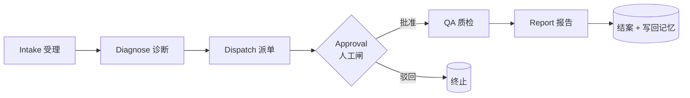

# FacilityMind

> 会「查证、会记经验」的设施报修大脑 · 基于 LangGraph + MCP 的多智能体运营中枢
>
> A multi-agent operations center for facility & property management.

[](https://www.python.org/)
[](LICENSE)
[](https://github.com/langchain-ai/langgraph)

---

## 它解决什么问题

物业设施管理里大量工作是「接报修 → 判原因 → 派工人 → 验质量 → 出报告」的重复链路。
单 Agent 聊天机器人解决不了跨系统、跨专业的闭环；FacilityMind 用**多个有明确职责的 Agent + 状态机编排**，
把这条链路自动化、可追溯、可干预——而且诊断不是拍脑袋，是**带着真实传感器证据**做的。

---

## 30 秒看懂（直接看效果）

```bash
pip install -r requirements.txt
python -m facilitymind.web          # 启动后打开 http://127.0.0.1:8000
```

打开网页 → 选一张示例工单 → 点「运行」，你会看到：

1. **6 个 Agent 节点依次点亮**：受理 → 诊断 → 派单 → 审批 → 质检 → 报告
2. **诊断阶段展开「执行链路时间线」**：先查历史记忆 → 再拉 IoT 传感器实时读数 → 最后 LLM 推理（这一步直接证明它是「证据化诊断」，不是瞎猜）
3. **高成本派单弹出审批卡**：点「批准 / 驳回」，流程继续或终止
4. **结案面板亮「本次写入记忆」徽章** → 切到「记忆层」Tab，能看到刚沉淀下的新知识

> 一句话：这是一个**会自己查证、会越用越聪明**的设施报修系统。
> 当前内置 20 张示例工单，开箱即跑；无 API Key 也能跑（自动走规则回退）。

<!-- 演示视频 / GIF 占位：把录好的短片放在 docs/demo.gif 或贴 YouTube 链接，访客 3 秒抓住重点 -->

---

## 核心亮点

| 亮点 | 它强在哪 |
| ---- | -------- |
| 🔬 **证据化诊断** | 诊断不是 LLM 凭空推理，而是经 MCP 拉取真实 IoT 传感器读数（送风温度、压差、电流…）作为根因佐证，结论可解释、可审计 |
| 🧠 **经验记忆自学习** | 每单结案自动写回记忆；下次遇到相似故障，自动分层召回历史经验（同楼宇同资产 → 跨楼宇同类型），置信度加权，**越跑越准** |
| 🔁 **ReAct 自主推理 + 全链路可观测** | 诊断 Agent 自己决定「先查记忆还是先拉传感器」，思考过程在时间线里看得一清二楚；每个节点的耗时、子调用、证据都落盘可复盘 |
| 🛡️ **可控 + 离线友好** | 高价值派单设一道人工闸（Human-in-the-Loop），成本超阈值才等人批；无 LLM Key 时整套降级为规则库，照样闭环 |

---

## 架构


```mermaid
graph LR
    A[Intake 受理] --> B[Diagnose 诊断]
    B --> C[Dispatch 派单]
    C --> D{Approval<br/>人工闸}
    D -->|批准| E[QA 质检]
    D -->|驳回| X[(终止)]
    E --> F[Report 报告]
    F --> G[(结案 + 写回记忆)]
```

| Agent | 职责 |
| ----- | ---- |
| **Intake** | 把报修文本结构化为工单（类型 / 紧急度 / 位置） |
| **Diagnose** | ReAct 自主查证：召回历史记忆 + 拉 IoT 遥测 + LLM 推理，输出根因、处置、成本、SLA |
| **Dispatch** | 按技能匹配资源池，输出最优派单方案 |
| **Approval** | Human-in-the-Loop：成本超阈值时 `interrupt()` 暂停，等人工批准 / 驳回 |
| **QA** | 模拟现场执行，对照检查清单逐项核验，输出通过与综合评分 |
| **Report** | 汇总全线结论，生成结案摘要与可执行优化建议，并写回经验记忆 |

---

## 快速开始

```bash
cd facilitymind
pip install -r requirements.txt
python -m facilitymind.web          # 默认 http://127.0.0.1:8000
```

- **不填任何 Key**：引擎自动走规则模式，开箱即跑。
- **想用大模型**：复制 `.env.example` 为 `.env`，填入兼容 OpenAI 的接口（已内置 DeepSeek / 通义千问 Qwen / 智谱 GLM / 本地 Ollama），填了即自动启用，任意 API 错误都安全回退规则库。

---

## 能力一览

| 能力 | 说明 |
| ---- | ---- |
| 🤝 多模型协作 | Model Registry 按 Agent 路由不同模型；Diagnose 阶段可多模型 Ensemble 合成结论；按模型拆分 Token / 成本 |
| 🔗 MCP 工具接入 | Agent 经标准 MCP 协议调用真实业务系统（内置 IoT 传感器）；新增系统 = 起一个 server + `mcp.json` 加一行，Agent 代码零改动 |
| 📚 内置知识库 | 8 类常见设施故障的处理经验 + 每类 QA 检查清单，离线可用 |
| ✅ 评估 Harness | 一键批量跑工单，量化完成率 / QA 通过率 / SLA / 成本 / Token，输出 Markdown + JSON |
| 🖥️ Web Dashboard | 浏览器内看 6-Agent 实时点亮、网页内人工确认、看评估图表、查记忆层 |

<details>
<summary><b>进阶：命令行 / 评估 / 记忆维护（点开）</b></summary>

**命令行跑单条工单**

```bash
python -m facilitymind.cli --id T-001                 # 成本超阈值会触发终端内人工确认
python -m facilitymind.cli --id T-001 --auto          # 跳过人工确认
python -m facilitymind.cli --id T-001 --ensemble     # Diagnose 多模型集成
python -m facilitymind.cli --id T-001 --compare      # 对比规则库 vs LLM 结论
```

**批量评估**

```bash
python -m facilitymind.eval --all --out eval_report.md --json eval_report.json
```

**维护经验记忆库（沉淀 + 归档）**

```bash
python scripts/memory_maintenance.py --run
```

</details>

---

## 技术栈

- **编排**：LangGraph 状态机（节点可审计、可重放、interrupt 暂停/恢复）
- **Web**：FastAPI + SSE 实时流 + 原生 JS（零前端构建）
- **工具协议**：MCP（Model Context Protocol），自研本地 IoT server，真实协议、可离线
- **记忆**：SQLite（事件记忆 / 资产档案 / 沉淀知识三层，分层检索 + 时间衰减 + 沉淀归档）
- **LLM 层**：可插拔 Model Registry（DeepSeek / Qwen / 智谱 / Ollama），无 Key 自动降级规则库
- **可观测**：结构化 Trace（CLI 树形 + JSONL 落盘 + Dashboard 时间线）

---

## Roadmap

- [x] 6-Agent 闭环（受理 → 诊断 → 派单 → 审批 → 质检 → 报告）
- [x] Human-in-the-Loop 审批、QA、报告
- [x] 评估 Harness、Web Dashboard
- [x] 多模型协作、MCP（IoT）接入、经验记忆层、全链路可观测、ReAct 自主诊断
- [ ] 多场景扩展（能耗优化 / 预防性保养）、对接 CMMS / ERP / IM、对话式 Intake 与长上下文压缩

## License

[MIT](LICENSE)
